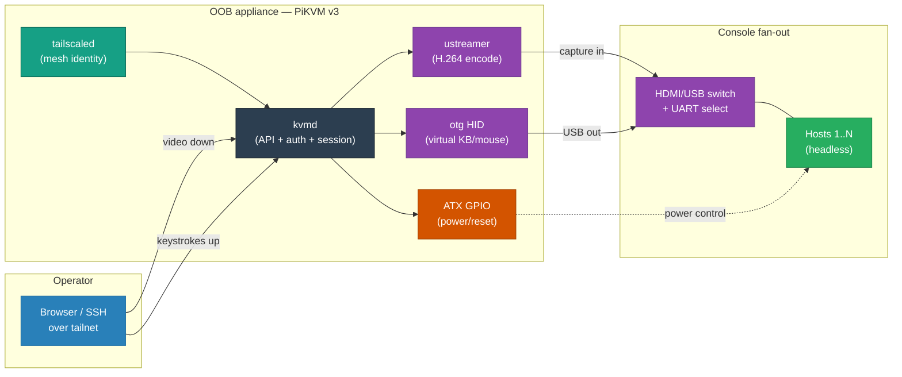
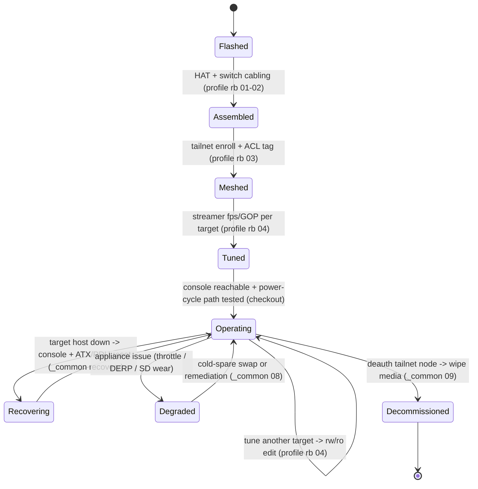

# PiKVM over Tailscale — Out-of-Band Management

### A DIY, sub-$200 out-of-band management plane — a reference design (HLD/LLD/ADRs/runbooks) for BIOS-level remote control of headless hosts, reachable from anywhere with zero public ports.

> **Engineering Philosophy / Thesis:** When a host freezes below the kernel, every in-band
> remote tool dies with it — and the naive fix is to forward a port or dispatch a technician,
> trading either your attack surface or your MTTR. The production answer is a management plane
> that *shares fate with nothing it manages*: capture below the OS, switch in hardware, expose
> over an identity-bound mesh with no inbound port, and keep the appliance immutable so a
> brownout can't brick it. This repo is that plane, built from commodity parts for the price of
> a single avoided smart-hands visit.

<!-- START_GENERATED:docs/diagrams/src/hero.mermaid -->

<!-- END_GENERATED:docs/diagrams/src/hero.mermaid -->

---

This is a **reference design**, not a turnkey product: the primary profile targets a DIY PiKVM v3
HAT on a Raspberry Pi 4 over a Tailscale tailnet, multiplexed across headless Apple Silicon and
mini-PC hosts. The HLD is deliberately vendor-agnostic — the *primitives* (out-of-band capture,
zero-trust overlay, hardware multiplexer, immutable appliance) outlive any specific product, so a
different appliance class or mesh provider is a new profile, not a rewrite. All addresses,
hostnames, and credentials are placeholders.

## Table of Contents

- [Business Case](#business-case)
- [Cost Model](#cost-model)
- [Why This Approach](#why-this-approach)
- [The Welds](#the-welds)
- [Architecture at a Glance](#architecture-at-a-glance)
- [Key Architecture Decisions](#key-architecture-decisions)
- [Lifecycle, Operations & Support](#lifecycle-operations--support)
- [Repository Layout](#repository-layout)
- [Quick Start](#quick-start)
- [Design Docs](#design-docs)
- [Scope & Constraints](#scope--constraints)
- [License](#license)

---

## Business Case

Operational efficiency at distributed edge sites and home labs is governed by **Mean Time To
Repair (MTTR)**. When a host wedges below the kernel — kernel panic, lost network config, a hang in
firmware — in-band remote access is useless and recovery collapses into one of two expensive paths:
an on-site **smart-hands dispatch** (~$250–$500/visit, days of scheduling lag) or a **hardware
shipping loop** ($50–$150 freight, site offline for days). An out-of-band control plane turns those
events into a sub-five-minute remote action — the only open question is *which* OOB primitive does
so without a four-figure price tag or a subscription gatekeeper.

### Financial Comparison Matrix

| Expense Class | Commercial enterprise KVM | Remote SRE dispatch | **This Design (DIY PiKVM + mesh)** |
|---|---|---|---|
| **Initial CapEx** | ~$600–1,800/node + license | $0 | **~$180** (SBC + HAT + cabling) |
| **Recurring OpEx** | ~$150/yr support | $250–$500 per event | **$0** (self-hosted overlay) |
| **MTTR** | < 5 min | 4–48 h | **< 5 min** |
| **Licensing** | Proprietary / gatekept | None | **Open source (MIT / GPL)** |

*ROI Conclusion:* the appliance **breaks even on its first avoided smart-hands dispatch**; every
recovery after that is pure margin. (Figures sourced in [COST-MODEL.md](docs/COST-MODEL.md).)

---

## Cost Model

> Summary only — full sourced breakdown in **[docs/COST-MODEL.md](docs/COST-MODEL.md)**.

This is a hardware appliance, not an AI workload — so the two planes that matter are
**infrastructure** (own-and-run the appliance) and **operational** (operate the recovery
capability). There is no model-inference/runtime-intelligence plane here.

| Plane | What drives it | This design's posture | Est. |
|---|---|---|---|
| **Infrastructure** | hardware CapEx (amortized) + power | DIY PiKVM v3; commodity parts; cents/month to run | **~$6/mo** (+ ~$180 sunk) |
| **Operational** | one-time build/flash toil + per-recovery value | self-hosted mesh, scripted telemetry — no per-use meter | **~$0/event** |

- **DIY vs commercial KVM-over-IP:** a DIY PiKVM v3 delivers the same instant-TTR, cardless-host
  coverage as a $600–1,800 commercial node — for ~$180, open-source, no recurring fee
  ([COST-MODEL §1](docs/COST-MODEL.md#1-infrastructure-plane--own-and-run-the-appliance)).
- **Operational payoff is asymmetric:** the recovery line item runs *negative* — every use
  replaces a $250–$500 dispatch with a < 5-minute remote action
  ([COST-MODEL §2](docs/COST-MODEL.md#2-operational-plane--operate-the-recovery-capability)).
- ⚠️ **Operational cost traps:** undervoltage silently throttles the encoder, sustained encode
  needs active cooling, a relay (DERP) fallback taxes throughput, and edits outside the `rw`/`ro`
  envelope vanish on reboot. Each is a control the design addresses, not a disclaimer. Full list:
  [COST-MODEL §3](docs/COST-MODEL.md#3-️-operational-cost-traps-read-before-deploying).

---

## Why This Approach

**Out-of-band, below the OS.** Capture the display signal off the GPU and inject input into the USB
host controller, independent of the target's software state — so a panicked kernel or a wedged
driver doesn't take the console with it.

**Portless exposure over a zero-trust overlay.** No inbound listener on the public WAN. Operator
reach rides an authenticated, encrypted mesh; the attack surface is an *identity*, not an open port
waiting on the internet. ([ADR-0002](docs/adr/0002-tailscale-mesh-over-port-forward.md))

**Determinism over convenience.** A driverless hardware multiplexer fans one console across N hosts
and fate-shares with none of them — a frozen target can't wedge the switch, unlike a software
multiplexer riding the target OS. ([ADR-0003](docs/adr/0003-hardware-switch-over-software-mux.md))

**Durability by immutability.** A read-only root filesystem survives brownouts and abrupt power loss
without corruption; changes are explicit and re-sealed. ([ADR-0006](docs/adr/0006-read-only-rootfs.md))

---

## The Welds

If you read nothing else: this is a recovery plane assembled from four primitives — an
out-of-band capture/HID/power appliance, a zero-trust mesh overlay, a hardware console
multiplexer, and an isolated network segment — welded so that the management path stays alive in
exactly the conditions that kill in-band access. The welds are where a pile of parts becomes a
resilient system:

| Weld | Out of the box | What this repo does |
|---|---|---|
| **Exposure** | port-forward / DMZ the KVM to reach it remotely | identity-bound mesh, **zero public ports**; reach is an authenticated tunnel, not an open listener |
| **Multiplexing** | software/OS multiplexer that hangs when the target hangs | driverless **hardware switch** over serial UART — deterministic selection even on a frozen host |
| **Appliance durability** | writable rootfs that corrupts on a brownout | **read-only root** by default; changes wrapped in an explicit `rw`/`ro` envelope |
| **Stream correctness** | default fps/GOP → judder + decoder freezes on packet loss | encode cadence **locked to the source refresh**, 1 s GOP self-heals loss in ≤ 1 s |
| **Segment** | KVM on the flat LAN, reachable from any device | dedicated **OOB VLAN**, default-deny inter-VLAN — no lateral path in or out |

---

## Architecture at a Glance

<!-- START_GENERATED:docs/diagrams/src/architecture_at_a_glance.mermaid -->

<!-- END_GENERATED:docs/diagrams/src/architecture_at_a_glance.mermaid -->

---

## Key Architecture Decisions

The load-bearing calls are documented as [Architecture Decision Records](docs/adr/README.md) —
each stating the alternatives that were genuine candidates and *why they lost*, not just the
chosen answer.

| ADR | Decision | Rejected alternatives |
|---|---|---|
| [0001](docs/adr/0001-dedicated-oob-vlan.md) | Dedicated, isolated OOB VLAN | flat LAN; per-host firewall rules |
| [0002](docs/adr/0002-tailscale-mesh-over-port-forward.md) | Zero-trust mesh, no public port | inbound port-forward; DMZ; commercial VPN appliance |
| [0003](docs/adr/0003-hardware-switch-over-software-mux.md) | Driverless hardware HDMI/USB switch | software multiplexer; per-host KVM; hypervisor console |
| [0004](docs/adr/0004-source-synchronized-encoding.md) | Source-synchronized encode cadence | fixed 30 fps; encoder-default pacing |
| [0005](docs/adr/0005-locked-gop-cadence.md) | Locked ~1 s GOP | encoder-default / intermittent keyframes |
| [0006](docs/adr/0006-read-only-rootfs.md) | Read-only root filesystem | writable root; journaling-only durability |
| [0007](docs/adr/0007-pikvm-over-commercial-oob.md) | DIY PiKVM over commercial OOB | enterprise KVM-over-IP; IPMI/iLO/iDRAC; smart-hands |

---

## Lifecycle, Operations & Support

The full lifecycle is owned here — **provision → deploy → operate → maintain → decommission** — to
show operational and support awareness, not just day-zero install. The operating model (monitoring,
capacity, upgrade cadence, support tiers, break-fix) lives in
**[docs/OPERATIONS.md](docs/OPERATIONS.md)**.

<!-- START_GENERATED:docs/diagrams/src/lifecycle.mermaid -->

<!-- END_GENERATED:docs/diagrams/src/lifecycle.mermaid -->

| Phase | Owns | Where |
|---|---|---|
| **Day-0 Provision** | flash + assemble + mesh-enroll + tune the appliance | [OPERATIONS](docs/OPERATIONS.md#day-0--provision-stand-it-up) + [profile runbooks 01–04](docs/runbooks/profile-pikvm-v3-pi4/README.md) |
| **Day-1 Validate** | prove it recovers: P2P path, every switch port, a real reset | [OPERATIONS](docs/OPERATIONS.md#day-1--validate-prove-it-recovers) |
| **Day-2 Operate** | monitoring (throttle + P2P-vs-relay), capacity, updates | [OPERATIONS](docs/OPERATIONS.md#day-2--operate-run-it-like-it-matters) |
| **Support / break-fix** | remediate in place → swap cold spare → escalate | [runbook 08](docs/runbooks/_common/08-cold-spare-and-break-fix/RUNBOOK.md) |
| **Day-N Decommission** | deauthorize mesh node, revoke creds, **wipe media** | [runbook 09](docs/runbooks/_common/09-decommission/RUNBOOK.md) |

Each transition is a documented runbook, not a tribal-knowledge checklist.
**Runbooks are split by [deployment profile](docs/runbooks/README.md#adding-a-profile)** — the
primary `profile-pikvm-v3-pi4` target is written concretely, with `_common/` operations reused
across any future appliance profile without a rewrite.

---

## Repository Layout

```
pikvm-tailscale-oob-tmpl/
├── README.md                  # you are here — business case, justification, summary, links
├── LICENSE                    # MIT
│
├── docs/
│   ├── HLD.md                 # vendor-AGNOSTIC: controls, protocols, patterns, the "what & why"
│   ├── LLD.md                 # vendor-SPECIFIC: BoM, pinouts, UART frames, IP plan, profiles
│   ├── TUNING.md              # media-engineering deep dive: fps/GOP, EDID, the encode story
│   ├── COST-MODEL.md          # infrastructure plane + operational plane + cost traps (sourced)
│   ├── OPERATIONS.md          # Day-0/1/2 + support model, monitoring, break-fix, lifecycle
│   ├── adr/                   # MADR decision records — alternatives considered + why they lost
│   ├── diagrams/
│   │   └── src/               # Mermaid sources (single source of truth, injected into docs)
│   └── runbooks/              # split by deployment profile (see below)
│       ├── _common/           #   profile-independent: troubleshooting, break-fix, decommission
│       └── profile-pikvm-v3-pi4/  # PRIMARY target (RPi 4 + PiKVM v3 HAT), written concretely
│
└── scripts/                   # build_docs.py (diagram injector) + telemetry/validation helpers
    ├── apply-streamer-profile.sh   # push fps/GOP override via kvmd API
    ├── health-snapshot.sh          # poll thermal/throttle/fps telemetry
    ├── path-probe.sh               # confirm direct P2P (not relay) mesh path
    └── validate.sh                 # local mirror of the CI gate
```

## Prerequisites & Dependencies

Everything the Quick Start and `scripts/` actually invoke — nothing padded.

| Tool | Version | Install | Purpose |
|---|---|---|---|
| `python3` | ≥ 3.8 | OS package | runs `build_docs.py` (diagram injection) |
| `bash` | ≥ 4 | OS package | `validate.sh` + helper scripts |
| `curl` | any | OS package | kvmd HTTP API calls in the helper scripts |
| `jq` | ≥ 1.6 | OS package | parses kvmd telemetry JSON in `health-snapshot.sh` |
| `tailscale` | current | [tailscale.com](https://tailscale.com/download) | mesh enrollment + `path-probe.sh` (on the appliance) |

> The appliance itself runs the PiKVM OS image (Arch Linux ARM); `kvmd`/`ustreamer`/`tailscaled`
> ship with it. Secrets (kvmd credentials, any power-controller API key) are supplied at runtime,
> never committed — see the `REPLACE_*` placeholders.

## Quick Start

> Full detail in [`docs/runbooks/`](docs/runbooks/README.md). Placeholders (`oob-kvm`, `10.0.20.x`,
> `REPLACE_*`) must be adapted to your environment.

```bash
# 1. Flash + assemble the appliance, then enroll it in your tailnet (runbooks 01–03)
tailscale up --hostname=oob-kvm --advertise-tags=tag:oob --accept-dns=true

# 2. Tune the stream to your target's refresh, then verify the recovery path (runbook 04)
scripts/apply-streamer-profile.sh   # push fps/GOP override via the kvmd API
scripts/health-snapshot.sh          # confirm throttle flags 0x0 + steady fps
scripts/path-probe.sh               # confirm a DIRECT P2P mesh path (not relay)

# Repo maintenance:
scripts/validate.sh                 # reproduce the CI gate locally
python3 scripts/build_docs.py       # re-inject diagrams after editing a source
```

## Design Docs

- **[High-Level Design](docs/HLD.md)** — vendor-agnostic: the problem, goals/non-goals,
  design principles, controls/protocols/patterns, lifecycle, risks.
- **[Low-Level Design](docs/LLD.md)** — vendor-specific: deployment profiles, concrete products,
  versions, addresses, commands, failure modes.
- **[Cost Model](docs/COST-MODEL.md)** — infrastructure plane (local vs cloud-managed) + runtime
  plane (model spend, the big three vs local) + the runtime cost traps.
- **[Operations & Support](docs/OPERATIONS.md)** — Day-0/1/2, monitoring, capacity, upgrade
  cadence, support tiers, break-fix.
- **[Architecture Decision Records](docs/adr/README.md)** — MADR format, each with the
  alternatives genuinely considered and why they were rejected.

## Scope & Constraints

- **In scope:** the OOB control plane — below-the-OS capture/HID/power, mesh exposure, hardware
  multiplexing, segment isolation, and the full appliance lifecycle.
- **Out of scope (intentionally):** power-distribution fate-sharing (assumes a UPS backs the
  appliance + switch + router); enterprise directory integration (LDAP/SAML) — access is a single
  trusted operator via mesh identity + local creds; target OS provisioning / PXE.
- **Known constraints / accepted risks:** total site power loss takes the appliance down unless
  UPS-backed; a persistent relay (DERP) path degrades the stream and is treated as a finding to
  fix, not a steady state; single-operator trust model has no RBAC granularity.

## License

MIT — see [LICENSE](LICENSE).
