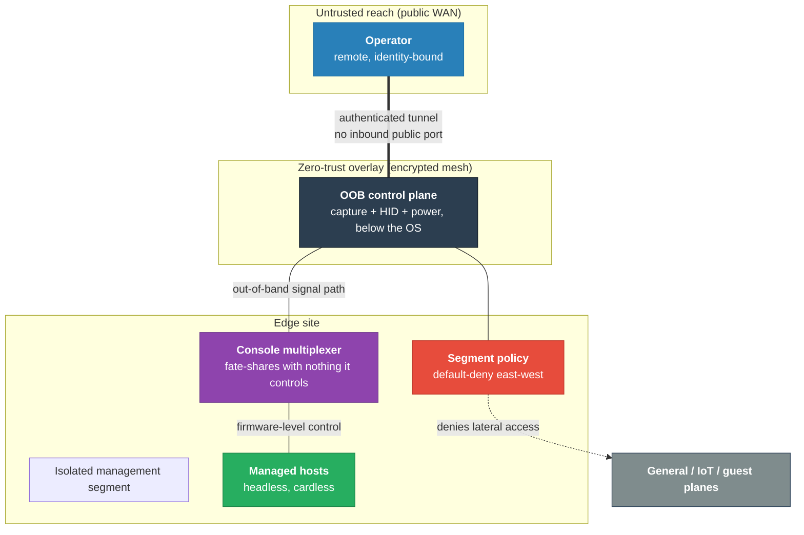
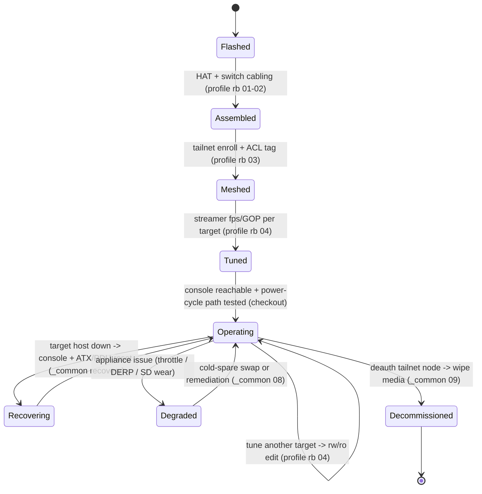

# High-Level Design — PiKVM over Tailscale (Out-of-Band Management)

The *why* behind this out-of-band architecture: the primitives, the controls, and the failure
boundaries — stated independently of any specific product. Concrete hardware, addresses, and CLI
live in [LLD.md](LLD.md); the media-engineering deep dive lives in [TUNING.md](TUNING.md).

<!-- START_GENERATED:docs/diagrams/src/hld_overview.mermaid -->

<!-- END_GENERATED:docs/diagrams/src/hld_overview.mermaid -->

> An operator with nothing but an identity reaches a control plane that sits *below* the host
> operating system, on a segment that can talk to nothing it does not own. When a host is dead at
> the kernel, the management primitive is still alive — because it was never sharing fate with the
> thing it manages.

---

## Table of Contents

- [1. Business Case & ROI](#1-business-case--roi)
- [2. Goals & Non-Goals](#2-goals--non-goals)
- [3. The Keystone Constraint](#3-the-keystone-constraint)
- [4. Principles](#4-principles)
- [5. Architecture (Agnostic)](#5-architecture-agnostic)
- [6. NAT-Traversal Mechanics](#6-nat-traversal-mechanics)
- [7. Physical Signal Isolation & Power Sequencing](#7-physical-signal-isolation--power-sequencing)
- [8. Fate-Sharing Boundaries](#8-fate-sharing-boundaries)
- [9. Lifecycle](#9-lifecycle)
- [10. Risk Register](#10-risk-register)

---

## 1. Business Case & ROI

Operational efficiency at distributed edge sites and home labs is governed by **Mean Time To
Repair (MTTR)**. When a host freezes below the kernel — kernel panic, lost network config, a boot
that hangs in firmware — every in-band remote tool is useless, and TTR collapses into one of two
expensive paths:

- **On-site "smart-hands" dispatch:** ~$250–$500 per visit, plus scheduling delay that stretches
  recovery from minutes to days. *(Source: typical managed-services remote-hands rate cards.)*
- **Hardware shipping loops:** $50–$150 in freight per round trip, with the site offline for days.

An out-of-band (OOB) control plane converts those events into a sub-five-minute remote action. The
design question is not *whether* OOB pays for itself — it is *which* OOB primitive does so without
a commercial price tag or a subscription gatekeeper.

The full sourced model — CapEx, OpEx, the AI-runtime carve-out (N/A here), and the operational cost
traps — is in [COST-MODEL.md](COST-MODEL.md). The headline comparison:

| Expense Class | Commercial enterprise KVM | Remote SRE dispatch | **This design (DIY KVM + mesh)** |
|---|---|---|---|
| **Initial CapEx** | ~$1,000 (device + license) | $0 | **~$180** (SBC + HAT + cabling) |
| **Recurring OpEx** | ~$150/yr support | $250–$500 per event | **$0** (self-hosted overlay) |
| **MTTR target** | < 5 min | 4–48 h | **< 5 min** |
| **Licensing** | Proprietary / gatekept | None | **Open source (MIT / GPL)** |

**ROI:** the model breaks even on the *first* avoided dispatch. Everything after is pure margin.

---

## 2. Goals & Non-Goals

**Goals**
- A robust OOB control plane offering firmware/BIOS-level access to headless hosts.
- Encrypted operator reach from anywhere, with **zero management services exposed to the public
  internet**.
- Deterministic selection across multiple target hosts from one console.
- Reliable operation on a residential power and bandwidth budget.

**Non-Goals (intentionally out of scope)**
- **Power-distribution fate-sharing.** Assumes a local UPS backs the appliance + switch + router.
  A total site power loss takes the appliance with it unless battery-backed.
- **Enterprise directory integration (LDAP/SAML).** Access is a single trusted operator via mesh
  identity + local credentials, not a federated IdP.
- **Target OS provisioning (PXE/netboot).** Bare-metal install of the *targets* (especially Apple
  Silicon) is handled by their own out-of-band tooling, not this plane.

---

## 3. The Keystone Constraint

> **The management plane must not share fate with anything it manages.**

Every later decision bends around this single invariant. The control path must stay alive and
reachable precisely in the conditions that kill in-band access: a panicked kernel, a wedged GPU
driver, a dropped LAN, a host stuck in firmware. If the recovery tool dies with the patient, it is
not a recovery tool. This constraint drives the segment isolation, the hardware (not software)
multiplexer, the read-only rootfs, and the below-the-OS capture/HID/power paths.

---

## 4. Principles

1. **Out-of-band, below the OS.** Capture raw display signal off the GPU and inject input into the
   USB host controller — independent of the target's software state.
2. **Portless exposure.** No inbound listener on the public WAN. Operator reach rides an
   authenticated, encrypted overlay; the attack surface is an identity, not an open port.
3. **Segment isolation, default-deny.** The control plane lives on its own management segment with
   no lateral path to or from general/IoT/guest planes.
4. **Determinism over convenience.** Physical, driverless switching beats software multiplexing
   that fate-shares with a target OS.
5. **Durability by immutability.** A read-only root filesystem survives brownouts and abrupt power
   loss without corruption; changes are explicit and re-sealed.
6. **Signal correctness over raw throughput.** Encode cadence is matched to the source so the
   stream stays smooth and self-heals under packet loss (see [TUNING.md](TUNING.md)).

---

## 5. Architecture (Agnostic)

The hero diagram above shows the four primitives; the relationships, stated without products:

- **Operator (untrusted reach).** A remote, identity-bound client. It holds no network position —
  only a verified identity on the overlay.
- **OOB control plane (isolated segment).** Performs three below-the-OS functions: **video capture**
  (display signal → encoded stream), **HID injection** (virtual keyboard/mouse into the USB host),
  and **power control** (firmware-level power/reset). It exposes one authenticated service surface.
- **Console multiplexer.** A driverless device that fans one capture/HID path across N hosts. It
  fate-shares with *nothing it controls* — a frozen target cannot wedge the switch.
- **Segment policy.** A default-deny boundary: only the operator overlay and explicitly-permitted
  local admins may reach the control plane; the control plane may not initiate laterally.

The transport is a **zero-trust encrypted overlay**: authenticated mesh membership, no public
ingress, identity-driven access policy.

---

## 6. NAT-Traversal Mechanics

Low-latency interactive console requires a **direct peer-to-peer** path between operator and
appliance. The overlay establishes it without any inbound port-forward:

```
[Operator Node]                                             [OOB Appliance]
       │                                                         │
       ├───────► (STUN) discover NAT mappings ◄──────────────────┤
       ├───────► UDP hole-punch — direct P2P attempt ◄────────────┤
       ├───X  blocked by symmetric NAT/firewall  X────────────────┤
       └─► encrypted relay fallback (TCP/HTTPS 443) ◄─────────────┘
```

1. **STUN** — peers discover their public IP:port mappings.
2. **UDP hole-punching** — peers send directly to each other's discovered mappings to stand up a
   P2P session.
3. **Encrypted relay fallback** — if a symmetric firewall blocks direct UDP, the session falls back
   to an encrypted relay over HTTPS.
   > **Operational constraint:** the relay path adds latency and caps throughput. A *direct* P2P
   > session is what keeps a 1080p console fluid; the relay is a correctness floor, not the target.

---

## 7. Physical Signal Isolation & Power Sequencing

**Display-detect isolation.** A physical multiplexer that toggles Hot-Plug-Detect (HPD) lines on
every switch forces the target GPU to reset its display pipeline — window reflows, flicker, lost
desktop layout. The control: present a **permanently-connected display** to each target by ignoring
inactive HPD, so the target renders as if the console never left. The switch is driven out-of-band
over a serial control interface so port selection is deterministic and decoupled from the targets.

**Hard power control.** When the OS is fully hung, soft shutdown is ignored. Two firmware-level
paths, neither dependent on target software:

```
Path A — chassis headers:  [relays] -> optocouplers -> target front-panel PWR/RST headers
Path B — switched power:    [control API] -> network power controller -> target AC supply
```

Path A simulates a physical button press (short = power click; long-hold = hard cut). Path B cycles
mains for targets without accessible front-panel headers (e.g. Apple Silicon Mac minis).

---

## 8. Fate-Sharing Boundaries

Where failure modes overlap — and why the keystone constraint holds:

| Failure mode | Impact on targets | Impact on OOB plane | Fallback / resolution |
|---|---|---|---|
| **Target kernel panic** | Target offline | **Unaffected** — console live | Reset via header relay or switched power |
| **Site LAN switch power drop** | Targets lose LAN | **Unaffected** — local console works | Overlay stays up on the appliance |
| **WAN link loss** | Target internet drops | **Overlay drops** — local LAN works | Reach via the local management segment |
| **Total site power loss** | Targets die | **Appliance drops unless UPS-backed** | UPS-back the appliance + switch + router |

---

## 9. Lifecycle

<!-- START_GENERATED:docs/diagrams/src/lifecycle.mermaid -->

<!-- END_GENERATED:docs/diagrams/src/lifecycle.mermaid -->

Provision → install → enroll → tune → operate, with maintain/diagnose/swap loops and a clean
decommission that revokes the mesh identity and wipes media. Each transition maps to a runbook;
the operating model (Day-0/1/2, monitoring, support tiers) lives in [OPERATIONS.md](OPERATIONS.md).

---

## 10. Risk Register

| Risk | Likelihood | Impact | Mitigation |
|---|---|---|---|
| SD-card corruption on power loss | Medium | Appliance down | Read-only rootfs ([ADR-0006](adr/0006-read-only-rootfs.md)); A2 media; SSD option |
| Undervoltage/thermal throttling degrades encode | Medium | Judder, dropped sessions | Spec'd PSU + active cooling; throttle-flag alerting (LLD §12) |
| Symmetric NAT forces relay-only path | Low–Med | Higher latency | Prefer direct P2P; relay as correctness floor (§6) |
| Single trusted-operator model | Accepted | No RBAC granularity | Mesh identity + local creds; documented non-goal (§2) |
| Total site power loss | Low | Full OOB loss | UPS-back appliance + switch + router (non-goal boundary) |
