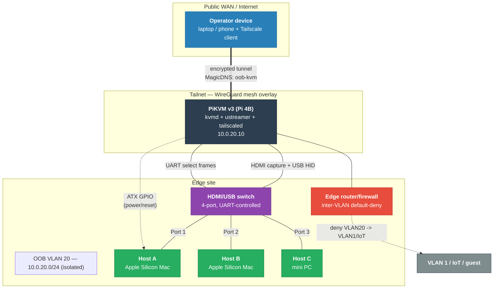

# Low-Level Design — PiKVM over Tailscale (Out-of-Band Management)

The reproducible *how*: concrete products, versions, addresses, pinouts, CLI, and config. Pairs
with [HLD.md](HLD.md) (the *why*) and [TUNING.md](TUNING.md) (the media-engineering detail).

<!-- START_GENERATED:docs/diagrams/src/lld_topology.mermaid -->

<!-- END_GENERATED:docs/diagrams/src/lld_topology.mermaid -->

---

## Table of Contents

- [1. Bill of Materials](#1-bill-of-materials)
- [2. Physical Connectivity & Wiring](#2-physical-connectivity--wiring)
- [3. ATX Power Relay Wiring](#3-atx-power-relay-wiring)
- [4. Network & IP Plan](#4-network--ip-plan)
- [5. Operating System & Filesystem](#5-operating-system--filesystem)
- [6. PiKVM Daemons & Services](#6-pikvm-daemons--services)
- [7. Video Streamer Override Schema](#7-video-streamer-override-schema)
- [8. Switch Serial UART Interface](#8-switch-serial-uart-interface)
- [9. Tailscale Provisioning & ACLs](#9-tailscale-provisioning--acls)
- [10. Router ACL Specifications](#10-router-acl-specifications)
- [11. HTTP Telemetry API & Scripts](#11-http-telemetry-api--scripts)
- [12. Operational Health Baselines](#12-operational-health-baselines)
- [13. Environment Profiles](#13-environment-profiles)

---

## 1. Bill of Materials

| Item | Specification | Role | Reference |
|---|---|---|---|
| **SBC** | Raspberry Pi 4 Model B (4/8 GB) | Compute + H.264 encode host | [pikvm docs](https://docs.pikvm.org) |
| **KVM HAT** | PiKVM v3 HAT (or DIY CSI-2 bridge) | HDMI capture, USB-OTG HID, ATX relays | [v3 platform](https://docs.pikvm.org) |
| **Capture chip** | TC358743 (HDMI→CSI-2) | Hardware capture, 1080p 50/60 Hz max | — |
| **Storage** | A2 microSD 32 GB+ or USB 3.0 SSD | OS media | — |
| **Switch** | 4-port HDMI/USB (PiKVM-compatible, e.g. EZCOO) | Physical multiplexing across targets | [pikvm switch](https://docs.pikvm.org/switch/) |
| **Multiport extender** | Switch Multiport Extender | Expands switch interfaces | [hipi shop](https://shop.hipi.io/product/pikvm-switch-multiport-extender) |
| **Cables** | HDMI + USB-A→USB-C OTG, per target | Dedicated signal delivery | — |
| **Power** | Official RPi 5 V / 3 A+ PSU | Stable voltage; prevents encode drops | — |
| **Cooling** | Active heatsink + PWM fan case | Dissipates H.264 encode thermal load | — |

> All part choices trace to [ADR-0003](adr/0003-hardware-switch-over-software-mux.md) (hardware
> switch) and [ADR-0007](adr/0007-pikvm-over-commercial-oob.md) (DIY over commercial OOB).

---

## 2. Physical Connectivity & Wiring

```
Pi 4 (PiKVM host)
 ├─ eth0 ───────────────► Router LAN port (access VLAN 20)
 ├─ CSI  ◄────────────── HDMI capture from switch (common out)
 └─ USB  ───────────────► USB-OTG control to switch (common in)

HDMI/USB switch (4-port multiplexer)
 ├─ Port 1 ◄──► Host A (HDMI out + USB HID in)
 ├─ Port 2 ◄──► Host B
 ├─ Port 3 ◄──► Host C
 └─ Port 4 ◄──► spare target
```

> **Stable multi-host switching:** set `ignore_hpd_on_top: true` in `/etc/kvmd/main.yaml` so
> inactive ports' hot-plug-detect pulses don't reset the capture bridge's EDID state
> ([ADR-0003](adr/0003-hardware-switch-over-software-mux.md)).

---

## 3. ATX Power Relay Wiring

For targets exposing chassis front-panel header pins, the PiKVM v3 HAT provides optocoupler relays:

```
                  PiKVM v3 HAT ATX control port
                ┌───────────────────────────────┐
                │ 1  2  3  4  5  6  7  8  9  10 │
                └─┬──┬──┬──┬──┬──┬──┬──┬──┬──┬──┘
      Power relay ─┘  │  │  │  │  │           └── Chassis GND
      Power relay ────┘  │  │  │  └────────────── Power-active LED (in)
      Reset relay ───────┘  │  └───────────────── Optocoupler VCC (+5 V)
      Reset relay ──────────┘
```

- **Power relay (pins 1–2):** to `PWR_BTN` headers. 200 ms short = power click (soft on/off);
  >5 s short = hard power cut.
- **Reset relay (pins 3–4):** to `RST_BTN` headers. Short = hard CPU reset, bypassing the OS.
- **Power-LED sense (pin 6):** to `PWR_LED`; reads +5 V when the target is running so `kvmd` tracks
  power state.

For targets without accessible headers (Apple Silicon Mac minis): drive a **network power
controller** via the kvmd API instead (HLD §7 Path B).

---

## 4. Network & IP Plan

Isolated block for the OOB management plane. **All values are sanitized placeholders.**

| Element | Value (placeholder) | Purpose |
|---|---|---|
| **OOB VLAN** | VLAN 20 | Broadcast-domain containment |
| **Subnet** | `10.0.20.0/24` | Management address pool |
| **Gateway (SVI)** | `10.0.20.1` | Router L3 interface |
| **PiKVM address** | `10.0.20.10` (static) | Appliance management IP |
| **Mesh DNS name** | `oob-kvm` | Private mapping via MagicDNS |
| **Overlay address** | `100.110.120.130` (example CGNAT-range) | Tailnet identity address |

---

## 5. Operating System & Filesystem

Custom Arch Linux ARM PiKVM OS image; root filesystem mounts **read-only** by default to prevent
SD wear and power-loss corruption ([ADR-0006](adr/0006-read-only-rootfs.md)).

```bash
rw            # remount / and /boot read-write
# ... persistent config / service changes ...
ro            # re-seal read-only
```

> **Warning:** `systemctl disable`, config edits, etc. appear to succeed but **revert on reboot**
> unless `rw` was issued first. Always close with `ro`.

---

## 6. PiKVM Daemons & Services

| Daemon | Role | Notes |
|---|---|---|
| `kvmd` | Main daemon + API | HTTP/WS interfaces, auth, session state |
| `kvmd-nginx` | Reverse proxy | Web UI/API over HTTPS (443) |
| `kvmd-webterm` | In-browser terminal | Shell over HTTPS, no SSH dependency |
| `ustreamer` | Video capture/encode | Raw frame grab → H.264 / WebRTC |
| `kvmd-watchdog` | Platform watchdog | Lockup detection via external RTC |

### RTC watchdog hotfix
On a Pi without an RTC battery, `kvmd-watchdog` fail-loops on `/sys/class/rtc/rtc0/since_epoch`,
burning ~7 % CPU and stealing encode cycles. Disable it:

```bash
rw
systemctl disable --now kvmd-watchdog
ro
```

---

## 7. Video Streamer Override Schema

Persistent overrides in `/etc/kvmd/override.yaml` map directly into the streamer runtime args. Full
reasoning in [TUNING.md](TUNING.md).

```yaml
kvmd:
    streamer:
        desired_fps: 25      # lock to an integer divisor of the source refresh (50 Hz -> 25)
        h264_gop: 25         # I-frame every 1 s at 25 fps -> self-heals loss in <=1 s
        h264_bitrate: 6000   # kbps transmission ceiling
        h264_profile: 1      # High profile
        h264_level: 41       # AVC level 4.1 (1080p up to 60 fps decode compatibility)
```

---

## 8. Switch Serial UART Interface

`kvmd` commands the HDMI/USB switch (e.g. EZCOO) over serial after flashing custom firmware:

- **Driver:** USB-to-UART CH340 bridge → `/dev/kvmd-switch`.
- **Settings:** **9600 baud, 8N1**.
- **Hex select frames:**
  - Port 1: `0x55 0x01 0x01 0x00 0x00 0x00 0x57`
  - Port 2: `0x55 0x01 0x02 0x00 0x00 0x00 0x58`
- **Firmware:** flash custom UART firmware via the switch's internal RX/TX lines —
  [switch datasheet](https://docs.pikvm.org/switch/switch_datasheet.pdf),
  [firmware updating](https://docs.pikvm.org/switch/#firmware-updating).

---

## 9. Tailscale Provisioning & ACLs

### Join + auto-authenticate
```bash
rw
curl -fsSL https://tailscale.com/install.sh | sh
systemctl enable --now tailscaled
tailscale up --hostname=oob-kvm --advertise-tags=tag:oob --accept-dns=true
ro
```

### Tailnet ACL policy
```json
{
  "tagOwners": { "tag:oob": ["autogroup:admin"] },
  "acls": [
    { "action": "accept", "src": ["autogroup:admin"], "dst": ["tag:oob:443"] }
  ],
  "ssh": [
    { "action": "accept", "src": ["autogroup:admin"], "dst": ["tag:oob"], "users": ["root"] }
  ]
}
```

Only verified admins reach the HTTPS console; tagged SSH is permitted for automation
([ADR-0002](adr/0002-tailscale-mesh-over-port-forward.md)).

---

## 10. Router ACL Specifications

Zero-trust enforcement at the local L3 boundary ([ADR-0001](adr/0001-dedicated-oob-vlan.md)):

```
Permit  Admin_Devices -> OOB_VLAN:443     # local web console
Permit  Tailscale_VPN -> OOB_VLAN:443     # mesh transit
Deny    IoT_Subnet    -> OOB_VLAN:Any     # block IoT
Deny    Guest_Subnet  -> OOB_VLAN:Any     # block guest
Deny    OOB_VLAN      -> General_Subnets  # prevent lateral movement
```

---

## 11. HTTP Telemetry API & Scripts

`kvmd` exposes telemetry over HTTPS; scripts poll it instead of opening interactive shells.

| Endpoint | Method | Response | Purpose |
|---|---|---|---|
| `/api/auth/check` | GET | `200 OK` | Credential validation |
| `/api/info?fields=hw` | GET | `{hw:{health:{temp:42.0}}}` | Thermal / system state |
| `/api/streamer` | GET | `{streamer:{source:{captured_fps:50}}}` | Resolution + sync cadence |
| `/api/streamer/set_params` | POST | `?desired_fps=25` | Inject overrides at runtime |
| `/api/log` | GET | journal text | Diagnostics |

```bash
# thermal / throttling snapshot — see scripts/health-snapshot.sh
curl -sk -H "X-KVMD-User: admin" -H "X-KVMD-Passwd: REPLACE_PASSWORD" \
  https://oob-kvm/api/info?fields=hw | jq '.contents.hw.throttling'
```

Helper scripts: [`apply-streamer-profile.sh`](../scripts/apply-streamer-profile.sh),
[`health-snapshot.sh`](../scripts/health-snapshot.sh),
[`path-probe.sh`](../scripts/path-probe.sh).

---

## 12. Operational Health Baselines

Healthy bounds for a Pi 4 under one WebRTC 1080p25 H.264 stream:

| Metric | Target | Action trigger |
|---|---|---|
| **CPU temp** | 40–45 °C | > 75 °C → check cooling |
| **CPU usage** | 8–20 % idle/low | > 80 % → watchdog loop or bad encode |
| **Throttling flags** | `0x0` | `!= 0x0` → undervoltage / PSU fault |
| **Captured FPS** | steady at divisor | tooth-pattern drops → EDID lock issue |
| **Tailnet jitter** | < 5 ms direct | > 50 ms → relayed (DERP) fallback |

---

## 13. Environment Profiles

This LLD is written concretely against the **primary profile**. A different OOB appliance class is a
new profile (HLD invariants unchanged), defined along these axes:

| Axis | Primary profile (`pikvm-v3-pi4`) | What a new profile must restate |
|---|---|---|
| **Appliance** | DIY PiKVM v3 HAT on Raspberry Pi 4B | SBC/appliance model, capture path |
| **Capture** | TC358743 HDMI→CSI-2, 1080p 50/60 Hz | capture chip + max signal |
| **Multiplexer** | 4-port HDMI/USB switch, CH340 UART @ 9600 8N1 | switch model + control protocol/frames |
| **Power control** | ATX header relays + optional network power controller | per-target power path |
| **Overlay** | Tailscale tailnet, `tag:oob`, ACL to `:443` | mesh provider, tags, ACL model |
| **Segment** | VLAN 20, `10.0.20.0/24`, default-deny inter-VLAN | VLAN/subnet + router ACLs |
| **OS** | Arch Linux ARM PiKVM image, read-only rootfs | base image + immutability model |

A material target switch (e.g. **PiKVM V4 Plus**, or a non-Pi IP-KVM) earns its own ADR and a new
`docs/runbooks/profile-<appliance>/` set; `_common/` operations are reused unchanged.
