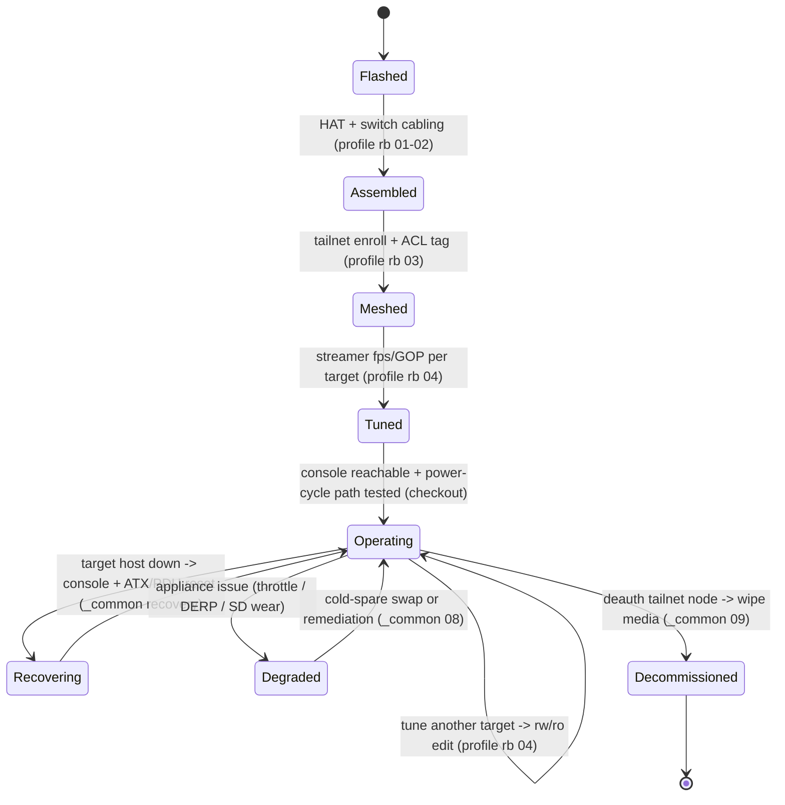

# PiKVM over Tailscale — Operations & Support

> The full operate-and-support picture, not just install. The README's flow is the map; this is the
> territory. The [runbooks](runbooks/README.md) are the *procedures*; this doc is the *operating
> model* — when to run them, who owns what, and how you know the appliance is healthy.

The lifecycle, as a state machine:

<!-- START_GENERATED:docs/diagrams/src/lifecycle.mermaid -->

<!-- END_GENERATED:docs/diagrams/src/lifecycle.mermaid -->

---

## Day-0 — Provision (stand it up)

What must exist before the appliance is trusted: a **flashed, assembled appliance** (PiKVM OS on
read-only root, HAT seated, switch cabled and firmware-flashed —
[profile rb 01–02](runbooks/profile-pikvm-v3-pi4)), an **enrolled mesh node** (tailnet-joined,
tagged `tag:oob`, ACL applied — [profile rb 03](runbooks/profile-pikvm-v3-pi4/03-tailscale-oob/RUNBOOK.md)),
and a **tuned streamer** (fps locked to source refresh, GOP locked to ~1s —
[profile rb 04](runbooks/profile-pikvm-v3-pi4/04-streamer-tuning/RUNBOOK.md)). Exit criterion: the
console is reachable over the mesh **and** the power-cycle path (ATX relay or smart-PDU) has been
exercised at least once.

## Day-1 — Validate (prove it recovers)

First full verification: reach the console from off-site over the mesh, confirm a **direct P2P path**
(not DERP) via `path-probe.sh`, select each target through the switch, and **test an actual reset** on
a non-production target. Exit criterion: console reachable, P2P confirmed, every switch port selects
its target, throttle flags clear (`0x0`) under an active stream, and a power-cycle visibly cycles a
target. A recovery appliance you haven't tested is not a recovery appliance ([COST-MODEL §3](COST-MODEL.md#3-️-operational-cost-traps-read-before-deploying)).

## Day-2 — Operate (run it like it matters)

Steady state. The appliance is idle until needed; the work is keeping it **ready** and catching
silent degradation before an incident. All persistent changes go through the `rw … ro` envelope
([ADR-0006](adr/0006-read-only-rootfs.md)) — an edit made without `rw` reverts on reboot.

### Monitoring & Health

| Signal | What it tells you | Source | Alert threshold |
|---|---|---|---|
| CPU temp | thermal headroom | `health-snapshot.sh` / `/api/info?fields=hw` | `> 75 °C` (check fan/heatsink) |
| Throttle raw flags | PSU/undervoltage health | `/api/info` throttling | `!= 0x0` (power supply / cabling) |
| CPU usage | encoder/watchdog sanity | `health-snapshot.sh` | `> 80%` sustained (bad encode / watchdog loop) |
| Captured FPS | EDID/sync lock | `/api/streamer` | tooth-pattern drops (re-check `ignore_hpd_on_top`) |
| Tailnet path | direct vs. relayed | `path-probe.sh` | persistent DERP fallback (fix NAT) |
| Tailnet ping jitter | console responsiveness | `path-probe.sh` | `> 50 ms` (relay) / `> 5 ms` local |
| Mesh node state | appliance reachable | tailnet admin / `tailscale status` | node offline |
| Power-cycle path | OOB reset actually works | periodic manual test | reset doesn't cycle target |

> **The throttle flag and the P2P-vs-DERP path are first-class operational signals here** — a
> throttled encoder and a relayed stream are the two failure modes that masquerade as "the network is
> slow." Catch them before an incident. See [COST-MODEL §3 traps](COST-MODEL.md#3-️-operational-cost-traps-read-before-deploying).

### The recovery procedure (the appliance's whole purpose)

When a target host locks below the OS:
1. Reach the console over the mesh (or the local VLAN-20 SVI if the WAN is down).
2. Select the target's port on the switch.
3. Observe the frozen console; attempt a soft action if the OS partially responds.
4. If unresponsive, **power-cycle** — short the ATX `PWR`/`RST` relay, or cycle the smart-PDU via API.
5. Watch the boot back up; confirm the host rejoins its network.

### Capacity & Scaling

Scale by **adding a target port**, not a second appliance — one PiKVM + switch covers up to 4 hosts
([ADR-0003](adr/0003-hardware-switch-over-software-mux.md)). Beyond 4, cascade an extender or add a
second appliance. Each new target costs a cable plus a one-time streamer-tuning pass.

### Updates & Maintenance

- **PiKVM OS / `kvmd`:** update inside the `rw` envelope, then re-seal `ro`; re-verify throttle flags
  and a direct P2P path afterward.
- **Switch firmware:** only re-flash when the switch integration requires it; serial flash, one-shot.
- **Tailscale:** keep the client current; ACL changes are made in the tailnet admin console, not on
  the node.

### Backups (config)

The appliance is near-stateless — its value is the hardware path, not stored data. Capture the small
config surface (`/etc/kvmd/override.yaml`, switch mappings, the tailnet ACL JSON) in version control
so a rebuild is a flash-and-restore, not a from-memory reconstruction.

## Day-N — Decommission (retire cleanly)

When the appliance is retired or repurposed:
1. **Deauthorize the tailnet node** in the admin console and remove the `tag:oob` device — leaving a
   stale authorized node is the security loose end that matters most here.
2. Revoke any smart-PDU API credentials it held.
3. `rw`, then **wipe the storage media** (the read-only rootfs is not erasure).
4. Confirm the node no longer appears in the tailnet and the OOB VLAN ACLs no longer reference it.

Exit criterion: zero authorized references remain — no orphaned tailnet node, no live PDU
credential, no ACL entry pointing at a decommissioned appliance.

---

## Support Model (who owns what)

| Layer | Owner | Escalation |
|---|---|---|
| Appliance hardware (Pi, HAT, switch, cabling) | site operator | swap from cold spare; re-flash |
| Mesh / ACL (tailnet) | tailnet admin | tailnet admin console; identity revocation |
| Target host recovery | host owner | the OOB plane is the *tool*; the host owner drives the fix |
| Network segment (VLAN/SVI/ACL) | network owner | router/switch config ([LLD §10](LLD.md#10-router-acl-specifications)) |
