# Video Pipeline Tuning — Out-of-Band Management

Case study: Diagnosing WebRTC frame drops and tuning the H.264 stream for interactive desktop and video-call performance. Pairs with [HLD.md](HLD.md) and [LLD.md](LLD.md).

---

## Table of Contents

- [1. The Problem Symptom](#1-the-problem-symptom)
- [2. Troubleshooting Methodology](#2-troubleshooting-methodology)
- [3. Video Pipeline Signal Flow](#3-video-pipeline-signal-flow)
- [4. Layer Isolation Analysis](#4-layer-isolation-analysis)
- [5. Root Cause 1: Default GOP Starvation](#5-root-cause-1-default-gop-starvation)
- [6. Root Cause 2: Refresh Rate Cadence Mismatch](#6-root-cause-2-refresh-rate-cadence-mismatch)
- [7. Root Cause 3: Watchdog Daemon CPU Stealing](#7-root-cause-3-watchdog-daemon-cpu-stealing)
- [8. Chroma Subsampling Constraints (4:2:0 Text Blurring)](#8-chroma-subsampling-constraints-420-text-blurring)
- [9. WebRTC Congestion Control Over Jittery Tunnels](#9-webrtc-congestion-control-over-jittery-tunnels)
- [10. Final Profile & Measured Performance](#10-final-profile--measured-performance)
- [11. Reusable Tuning Checklist](#11-reusable-tuning-checklist)

---

## 1. The Problem Symptom

Under active deployment testing, remote KVM streams encountered the following stability issues:
- **Interactive session freezing:** The video path would freeze entirely during high-motion tasks (desktop window dragging, video playback, online calls) and require **≥1.0 seconds** to recover.
- **Path integrity:** The freeze occurred on high-bandwidth, direct peer-to-peer Tailscale connections with low latency.
- **Symptom severity:** Negligible drops when the captured screen remained static, indicating the issue was motion-dependent.

---

## 2. Troubleshooting Methodology

To identify the root cause systematically, the diagnostic process followed these tenets:
1. **Characterize before changing:** Gather metrics (CPU usage, thermal state, socket drops) prior to applying any configuration changes.
2. **Isolate the layers:** Establish proof of innocence or guilt for each part of the pipeline: the Network, Host SBC, Encoder, and Source.
3. **One variable at a time:** Adjust a single setting, test, and then choose to persist or roll back.
4. **Avoid repetitive fixes:** If two changes in the same pipeline layer show no performance gains, stop and re-isolate.

---

## 3. Video Pipeline Signal Flow

The capture-to-display chain involves multiple hardware conversions and transport mechanisms:

```mermaid
flowchart LR
    subgraph Target ["1. Target Host SVI"]
        GPU["GPU Framebuffer<br/>1080p @ 50/60Hz"]
        HDMI["HDMI Output<br/>RGB / TMDS Signaling"]
    end

    subgraph PiKVM ["2. PiKVM Appliance (Pi 4)"]
        CSI["TC358743 Bridge<br/>HDMI → CSI-2 Conversion<br/>RGB to YUV422"]
        MEM["SoC RAM Buffer<br/>Direct Memory Access (DMA)"]
        ENC["Broadcom H.264 SoC Encoder<br/>Hardware Encoding<br/>YUV422 to YUV420p (Chroma 4:2:0)"]
    end

    subgraph Overlay ["3. Network Overlay (Tailscale)"]
        Mesh["WireGuard Tunnel<br/>WebRTC RTP/SRTP Packets<br/>Dynamic Congestion Control"]
    end

    subgraph Operator ["4. Operator Workstation"]
        DEC["Browser H.264 Decoder<br/>Hardware-accelerated rendering"]
        Screen["KVM Web Console View<br/>Low-latency canvas paint"]
    end

    GPU --> HDMI
    HDMI -->|"TMDS lines"| CSI
    CSI -->|"CSI-2 lanes"| MEM
    MEM --> ENC
    ENC -->|"WebRTC / UDP"| Mesh
    Mesh --> DEC
    DEC --> Screen

    style GPU fill:#2980b9,color:#fff,stroke:#1f6fa5
    style CSI fill:#2c3e50,color:#fff,stroke:#1a252f
    style ENC fill:#8e44ad,color:#fff,stroke:#713f8f
    style Mesh fill:#e74c3c,color:#fff,stroke:#c0392b
    style Screen fill:#27ae60,color:#fff,stroke:#1e8449
```

<!-- START_GENERATED:docs/diagrams/src/signal_flow.mermaid -->

<!-- END_GENERATED:docs/diagrams/src/signal_flow.mermaid -->

---

## 4. Layer Isolation Analysis

### Network: INNOCENT
Local Tailscale mesh ping tests to the node:
- **Jitter & Loss:** `0% packet loss` over 150 cycles.
- **Latency:** Steady `~1.5 - 2.0 ms`.
- **Path:** Confirmed direct peer-to-peer (no DERP relays in use).
*Conclusion:* The physical and overlay network path is not the cause.

### Host SBC Hardware: INNOCENT
Diagnostic query via `/api/info?fields=hw`:
- **Temperatures:** Steady at `~42 °C` under active fan cooling.
- **Voltage Throttling:** `throttling.raw_flags = 0x0` (No undervoltage occurred).
- **CPU Idle Margin:** Steady state at ~11% idle, peaking at ~58% under encode load.
*Conclusion:* The Pi is not thermally throttled or running low on power.

### Encoder & Source: GUILTY
The `/api/streamer` response revealed critical clues:
- `source.captured_fps: 50`
- `h264.fps: 25`
- `h264.gop: 0`
*Conclusion:* The encoder GOP and frame rate pace mismatched the target signal's incoming parameters.

---

## 5. Root Cause 1: Default GOP Starvation

The H.264 Group of Pictures (GOP) interval defines the frequency of full, self-contained keyframes (I-frames) vs. delta changes (P/B-frames). 

* **The Issue:** With `h264_gop` set to `0`, the encoder emitted keyframes on an arbitrary schedule. When the WebRTC decoder lost a delta packet, it froze and was forced to wait until a new keyframe arrived to resynchronize.
* **The Fix:** Force keyframe insertion every 1.0 second by matching the GOP to the target frame rate:
  ```yaml
  desired_fps: 25 -> h264_gop: 25
  desired_fps: 30 -> h264_gop: 30
  ```
  Self-healing recovery time dropped to **≤1.0 second** after packet drops.

---

## 6. Root Cause 2: Refresh Rate Cadence Mismatch

After fixing the GOP interval, high-motion desktop elements still exhibited stutters and judder.

* **The Issue:** The target host was outputting a `1080p 50Hz` signal. The Pi 4 hardware encoder cannot sustain `1080p 50 fps`, and naturally dropped to a `2:1` half-cadence of `25 fps`. However, the streamer was configured with `desired_fps=30`. Because 50 is not an integer divisor of 30, the encoder dropped frames at irregular intervals to approximate 30 fps, producing visual judder.
* **The Fix:** Align the encoder's target frame rate to an integer divisor of the source refresh rate. For a `50Hz` source, lock the target to `25 fps`. This yields a smooth, even capture cadence.

| Source Refresh | Clean Divisor Target |
|---|---|
| **60 Hz** | 30 fps, 20 fps |
| **50 Hz** | 25 fps, 10 fps |
| **30 Hz** | 15 fps, 10 fps |

---

## 7. Root Cause 3: Watchdog Daemon CPU Stealing

Even after resolving the video path parameters, rare video stutters occurred. The Nginx journals revealed that the system watchdog daemon (`kvmd-watchdog`) was restart-looping.

* **The Issue:** The default PiKVM image expects an external Real Time Clock (RTC) chip, which was missing from this Pi. The daemon crash-looped looking for `/sys/class/rtc/rtc0/since_epoch`. Because systemd was configured to automatically restart the service, it triggered an continuous loop of process spawns, causing CPU interrupt storms that starved the real-time encoder stream.
* **The Fix:** Mount the root directory read-write and disable the service:
  ```bash
  rw
  systemctl disable --now kvmd-watchdog
  ro
  ```
  This dropped overall idle CPU usage by **~7%** and eliminated the capture blips.

---

## 8. Chroma Subsampling Constraints (4:2:0 Text Blurring)

In a remote KVM context, rendering crisp text is critical for console readability. However, standard video encoding pipelines compromise text sharpness through color-space compression:

```
[Target Output: RGB24 / YUV444] (Full color detail per pixel)
               │
               ▼
[TC358743 Capture: YUV422] (Chroma resolution halved horizontally)
               │
               ▼
[Broadcom Encoder: H.264 YUV420p (4:2:0)] (Chroma resolution halved horizontally and vertically)
```

### The Blurring Mechanism:
H.264 encoding defaults to YUV420p (4:2:0) chroma subsampling to save bandwidth. This format maps color information across 2x2 pixel blocks while preserving brightness (luma) detail. 

High-contrast, high-frequency boundaries—such as **red terminal text on a blue background**—will smear and blur because the encoder lacks the color resolution to draw sharp edges between adjacent red and blue pixels.

### Mitigation Strategies:
1. **Optimize Contrast Themes:** Use high-contrast, black-and-white or green-on-black terminal themes. These rely heavily on luma (brightness) rather than chroma (color), preserving sharpness.
2. **Elevate Encoder Bit Rate:** Increase `h264_bitrate` to **6000 kbps** to allocate extra bits to edge details, minimizing blockiness around characters.

---

## 9. WebRTC Congestion Control Over Jittery Tunnels

WebRTC transports stream payloads over UDP using RTP/SRTP. Unlike TCP, UDP does not enforce delivery guarantees. Over high-jitter links (such as cellular networks or congested Wi-Fi), network stability depends on dynamic congestion controls:

- **GCC (Google Congestion Control):** Evaluates delay variations and packet loss trends at the receiver. If jitter increases, the receiver signals the sender to reduce its bit rate before packets drop.
- **Retransmission (NACK):** When a video frame packet is lost, the decoder sends a NACK request to retransmit only that packet, avoiding a full keyframe request.
- **Cadence Recovery:** If a NACK fails and the frame is broken, our tuned 1.0-second GOP ensures the decoder receives a clean I-frame within 1 second, restoring the screen without requiring a session restart.

---

## 10. Final Profile & Measured Performance

Tuned stable profile for a `1080p 50Hz` source environment:

```yaml
kvmd:
    streamer:
        desired_fps: 25     # Even divisor of the 50 Hz source
        h264_gop: 25        # 1 keyframe / second interval
        h264_bitrate: 6000  # Target allocation for 1080p25
```

### Verified Health State

| Metric | Measured Baseline | Status |
|---|---|---|
| **Output Cadence** | Locked `25 fps` (no drops) | ✅ OPTIMAL |
| **CPU Temp** | `~40 °C` (active fan) | ✅ OPTIMAL |
| **SBC CPU Load** | `~7%` idle, peaks to `48%` | ✅ OPTIMAL |
| **Recovery Latency** | `≤ 1.0 second` after loss | ✅ OPTIMAL |

*Result:* The pipeline is stable enough to run **real-time Teams / Google Meet calls on the target host through the remote KVM session**.

---

## 11. Reusable Tuning Checklist

Use this list to verify and tune new edge KVM deployments:

- [ ] **Direct Path Check:** Verify `tailscale ping` reports `via <lan-ip>` and not a DERP relay.
- [ ] **Thermal / Power Check:** Run `vcgencmd get_throttled` and verify it returns `0x0`.
- [ ] **GOP Check:** Match `h264_gop` to the target `desired_fps` (1-second keyframe pacing).
- [ ] **Cadence Check:** Verify `desired_fps` is an integer divisor of the measured `source.captured_fps`.
- [ ] **Watchdog Check:** Disable `kvmd-watchdog` if the SBC lacks a physical battery-backed RTC.
- [ ] **Filesystem Check:** Ensure all overrides are saved after mounting the disk read-write (`rw`).
